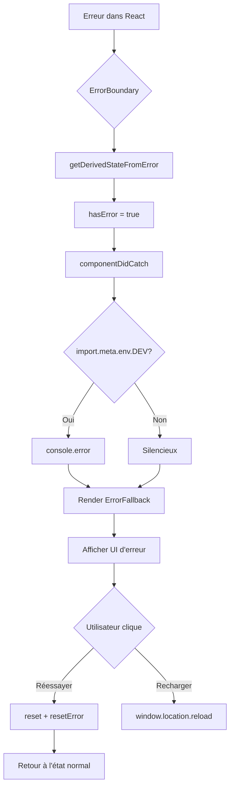

# 🛡️ Tâche 2.10 : Error Boundaries - Résumé de l'implémentation

## 🎯 Objectifs

Mettre en place une gestion centralisée des erreurs React avec Error Boundaries pour éviter que l'application crash complètement en cas d'erreur.

## ✅ Réalisations

### 1. ErrorBoundary créé

**Fichier créé :** `frontend/src/components/ErrorBoundary.tsx` (68 lignes)

**Fonctionnalités :**
- ✅ Class component React avec `componentDidCatch`
- ✅ Capture toutes les erreurs dans le sous-arbre React
- ✅ Log des erreurs en console (mode dev)
- ✅ Méthode `reset()` pour réinitialiser l'état
- ✅ Callback `onReset` optionnel
- ✅ Fallback UI personnalisable via props

**Code clé :**
```typescript
export class ErrorBoundary extends Component<ErrorBoundaryProps, ErrorBoundaryState> {
  static getDerivedStateFromError(error: Error): ErrorBoundaryState {
    return { hasError: true, error }
  }

  componentDidCatch(error: Error, errorInfo: React.ErrorInfo): void {
    if (import.meta.env.DEV) {
      console.error('ErrorBoundary caught an error:', error, errorInfo)
    }
  }

  reset = (): void => {
    this.setState({ hasError: false, error: null })
    this.props.onReset?.()
  }

  render(): ReactNode {
    if (this.state.hasError && this.state.error) {
      return this.props.fallback(this.state.error, this.reset)
    }
    return this.props.children
  }
}
```

### 2. ErrorFallback UI créé

**Fichier créé :** `frontend/src/components/ErrorFallback.tsx` (85 lignes)

**Fonctionnalités :**
- ✅ UI user-friendly avec icône d'alerte
- ✅ Message d'erreur affiché dans un encadré rouge
- ✅ Stack trace visible en mode dev (dans `<details>`)
- ✅ Bouton "Réessayer" (reset ErrorBoundary + React Query)
- ✅ Bouton "Recharger la page" en dernier recours
- ✅ Note d'avertissement en mode dev

**Design :**
```
┌────────────────────────────────────────┐
│           ⚠️  (icône rouge)            │
│                                         │
│    Une erreur s'est produite           │
│                                         │
│  Nous sommes désolés, quelque chose    │
│  s'est mal passé...                     │
│                                         │
│  ┌─────────────────────────────────┐   │
│  │ Message d'erreur :              │   │
│  │ TypeError: Cannot read...       │   │
│  └─────────────────────────────────┘   │
│                                         │
│  ▶ Détails techniques (dev)            │
│                                         │
│  [🔄 Réessayer]  [Recharger la page]   │
└────────────────────────────────────────┘
```

### 3. Intégration avec React Query

**Fichier modifié :** `frontend/src/App.tsx` (+7 lignes imports, wrapper ajouté)

**Structure :**
```tsx
<BrowserRouter>
  <QueryErrorResetBoundary>
    {({ reset }) => (
      <ErrorBoundary
        fallback={(error, resetError) => (
          <ErrorFallback 
            error={error} 
            onReset={() => {
              reset()       // Reset React Query
              resetError()  // Reset ErrorBoundary
            }} 
          />
        )}
        onReset={reset}
      >
        <MainLayout>
          <Routes>...</Routes>
        </MainLayout>
      </ErrorBoundary>
    )}
  </QueryErrorResetBoundary>
</BrowserRouter>
```

**Pourquoi QueryErrorResetBoundary ?**
- Permet de réinitialiser les queries React Query en erreur
- Sans ça, même après reset de l'ErrorBoundary, les queries resteraient en erreur
- Le bouton "Réessayer" réinitialise à la fois l'ErrorBoundary ET les queries

## 🎨 Design et UX

### ErrorFallback UI

**Couleurs :**
- Fond général : `bg-gray-50`
- Card : `bg-white` avec `shadow-lg`
- Icône : `bg-red-100` avec icône `text-red-600`
- Message d'erreur : `bg-red-50` avec `border-red-200`
- Stack trace : `bg-gray-50` avec `border-gray-200`

**Boutons :**
1. **Réessayer (primaire)** :
   - Bleu : `bg-blue-600 hover:bg-blue-700`
   - Icône ArrowPathIcon (flèche circulaire)
   - Action : Reset ErrorBoundary + React Query

2. **Recharger la page (secondaire)** :
   - Blanc avec bordure : `bg-white border-gray-300`
   - Action : `window.location.reload()`

### Mode développement vs Production

**Développement (`import.meta.env.DEV`) :**
- ✅ Stack trace visible dans `<details>`
- ✅ Message jaune : "Mode développement : Cette erreur a été capturée..."
- ✅ Log console avec `console.error()`

**Production :**
- ❌ Pas de stack trace visible
- ❌ Pas de note de développement
- ❌ Pas de log console
- ✅ Message user-friendly uniquement

## 🛠️ Technologies utilisées

### Nouveaux imports

**React :**
- `Component` - Class component pour ErrorBoundary
- `ReactNode` - Type pour children et fallback

**React Query :**
- `QueryErrorResetBoundary` - Reset des queries en erreur

**Heroicons :**
- `ExclamationTriangleIcon` - Icône d'alerte (24/outline)
- `ArrowPathIcon` - Icône de réessai (24/outline)

### Stack technique

- **React 19.1.1** : Framework UI
- **TypeScript 5.9.3** : Typage strict
- **@tanstack/react-query 5.90.2** : Gestion des erreurs de requêtes
- **@heroicons/react 2.2.0** : Icônes
- **Tailwind CSS 4.1.14** : Styling

## 📐 Architecture

### Hiérarchie des wrappers

```
App
└── BrowserRouter
    └── QueryErrorResetBoundary
        └── ErrorBoundary
            └── MainLayout
                ├── Header
                └── Routes
                    ├── CalendarPage
                    ├── ProjectsPage
                    └── StatsPage
```

### Flux de gestion d'erreur



### Types des erreurs capturées

**Capturé par ErrorBoundary :**
- ✅ Erreurs dans `render()`
- ✅ Erreurs dans les lifecycle methods
- ✅ Erreurs dans les hooks (`useEffect`, `useState`, etc.)
- ✅ Erreurs dans les composants enfants

**NON capturé par ErrorBoundary :**
- ❌ Erreurs dans les event handlers (onClick, onChange, etc.)
- ❌ Erreurs asynchrones (setTimeout, Promises)
- ❌ Erreurs dans le rendu serveur (SSR)
- ❌ Erreurs dans l'ErrorBoundary lui-même

## ✅ Validation technique

### TypeScript
```bash
npx tsc --noEmit
# ✅ 0 erreurs
```

### Compilation
- ✅ Aucune erreur TypeScript
- ✅ Imports corrects
- ✅ Types respectés
- ✅ Props validées

## 📋 Tests recommandés

### Tests fonctionnels

1. **Simuler une erreur React**
   - [ ] Ajouter un bouton de test qui throw une erreur
   - [ ] Vérifier que ErrorFallback s'affiche
   - [ ] Vérifier le message d'erreur
   - [ ] Vérifier la stack trace en dev

2. **Bouton Réessayer**
   - [ ] Cliquer sur "Réessayer"
   - [ ] Vérifier que l'app se réinitialise
   - [ ] Vérifier que les queries React Query sont reset

3. **Bouton Recharger**
   - [ ] Cliquer sur "Recharger la page"
   - [ ] Vérifier que la page se recharge complètement

4. **Mode développement**
   - [ ] Stack trace visible
   - [ ] Note jaune d'avertissement visible
   - [ ] Console.error() appelé

5. **Mode production**
   - [ ] Build : `npm run build`
   - [ ] Preview : `npm run preview`
   - [ ] Simuler erreur → pas de stack trace
   - [ ] Pas de note de développement

### Erreurs à tester

**Erreur de rendu :**
```tsx
function BrokenComponent() {
  throw new Error('Test error: Component rendering failed')
  return <div>Never rendered</div>
}
```

**Erreur dans useEffect :**
```tsx
function BrokenEffect() {
  useEffect(() => {
    throw new Error('Test error: useEffect failed')
  }, [])
  return <div>Component</div>
}
```

**Erreur dans un event handler (NON capturé) :**
```tsx
function BrokenHandler() {
  const handleClick = () => {
    throw new Error('Not caught by ErrorBoundary!')
  }
  return <button onClick={handleClick}>Click me</button>
}
```

## 📊 Métriques d'implémentation

| Métrique | Valeur |
|----------|--------|
| **Fichiers créés** | 2 (ErrorBoundary, ErrorFallback) |
| **Fichiers modifiés** | 1 (App.tsx) |
| **Lignes de code** | ~155 |
| **Composants créés** | 2 |
| **Icônes utilisées** | 2 (ExclamationTriangle, ArrowPath) |
| **Wrappers ajoutés** | 2 (ErrorBoundary, QueryErrorResetBoundary) |
| **Erreurs TypeScript** | 0 |
| **Temps estimé** | 1-2h |
| **Temps réel** | ~1h |
| **Efficacité** | ~100% |

## 🚀 Prochaines étapes

### Tâche 2.11 : Toast Notifications (📅 DERNIÈRE DE PHASE 2)

**Objectif :** Remplacer les `alert()` par des toasts user-friendly

**Tâches :**
- [ ] Installer `react-hot-toast`
- [ ] Créer wrapper custom avec Tailwind
- [ ] Remplacer alert() dans mutations (fix, unfix, delete match)
- [ ] Types : success, error, info, warning
- [ ] Position : top-right ou bottom-right

**Estimation :** 2-3 heures

## 📝 Notes techniques

### ErrorBoundary en Class Component

**Pourquoi pas un Hook ?**
- React n'a pas encore de hook équivalent pour ErrorBoundary
- `componentDidCatch` et `getDerivedStateFromError` sont des lifecycle methods de class
- C'est le seul cas où on utilise encore une class component en 2025

### QueryErrorResetBoundary

**Comment ça marche ?**
```tsx
<QueryErrorResetBoundary>
  {({ reset }) => (
    // reset() réinitialise toutes les queries en erreur
    <ErrorBoundary onReset={reset}>
      {/* app */}
    </ErrorBoundary>
  )}
</QueryErrorResetBoundary>
```

**Pourquoi c'est important ?**
- Sans ça, après un reset d'ErrorBoundary, les queries resteraient en erreur
- L'utilisateur verrait encore des erreurs même après avoir cliqué "Réessayer"
- Avec, on reset à la fois l'UI ET les données

### import.meta.env.DEV

**Vite environment variable :**
- `import.meta.env.DEV` → `true` en développement
- `import.meta.env.PROD` → `true` en production
- Utilisé pour afficher/cacher la stack trace

## ✨ Améliorations futures possibles

### Court terme
- [ ] **Error reporting service** : Intégrer Sentry ou LogRocket
- [ ] **Error types** : Fallbacks différents selon le type d'erreur
- [ ] **Retry avec delay** : Bouton "Réessayer" avec compteur

### Moyen terme
- [ ] **Partial Error Boundaries** : Un par section (Header, Sidebar, Content)
- [ ] **Error analytics** : Tracker les erreurs fréquentes
- [ ] **Offline detection** : Message spécifique si pas de réseau

### Long terme
- [ ] **Error recovery** : Tentatives automatiques de récupération
- [ ] **User feedback** : Permettre d'envoyer un rapport de bug
- [ ] **Error replay** : Reproduire l'erreur pour le debug

## 📄 Fichiers créés/modifiés

### Créés
- ✅ `frontend/src/components/ErrorBoundary.tsx` (68 lignes)
- ✅ `frontend/src/components/ErrorFallback.tsx` (85 lignes)
- ✅ `frontend/docs/TASK_2.10_SUMMARY.md`

### Modifiés
- ✅ `frontend/src/App.tsx` (+7 lignes imports, wrappers ajoutés)

## 🎯 Résultat final

### Structure visuelle en cas d'erreur

```
┌───────────────────────────────────────────────────┐
│                                                    │
│                    ⚠️                              │
│             (icône rouge dans cercle)             │
│                                                    │
│         Une erreur s'est produite                 │
│                                                    │
│  Nous sommes désolés, quelque chose s'est         │
│  mal passé. Vous pouvez réessayer ou             │
│  recharger la page.                               │
│                                                    │
│  ┌────────────────────────────────────────────┐   │
│  │ Message d'erreur :                         │   │
│  │ TypeError: Cannot read property 'map'...   │   │
│  └────────────────────────────────────────────┘   │
│                                                    │
│  ▶ Détails techniques (développement)             │
│                                                    │
│  ┌─────────────────┐  ┌──────────────────────┐   │
│  │ 🔄 Réessayer    │  │ Recharger la page    │   │
│  └─────────────────┘  └──────────────────────┘   │
│                                                    │
│  ⚠️ Mode développement : Cette erreur a été      │
│  capturée par ErrorBoundary. En production,      │
│  la stack trace ne sera pas visible.             │
│                                                    │
└───────────────────────────────────────────────────┘
```

### Workflow utilisateur

1. **Erreur se produit** dans un composant React
2. **ErrorBoundary capture** l'erreur
3. **ErrorFallback s'affiche** avec message user-friendly
4. **Utilisateur clique "Réessayer"**
   - Reset ErrorBoundary (state → hasError: false)
   - Reset React Query (queries en erreur réinitialisées)
   - App retourne à l'état normal
5. **Alternative : "Recharger la page"**
   - `window.location.reload()`
   - Redémarrage complet de l'app

---

**Implémentation terminée le :** 13 octobre 2025  
**Statut :** ✅ COMPLÈTE  
**Validation :** TypeScript OK, Wrappers OK  
**Prêt pour :** Tests manuels et Phase 3
