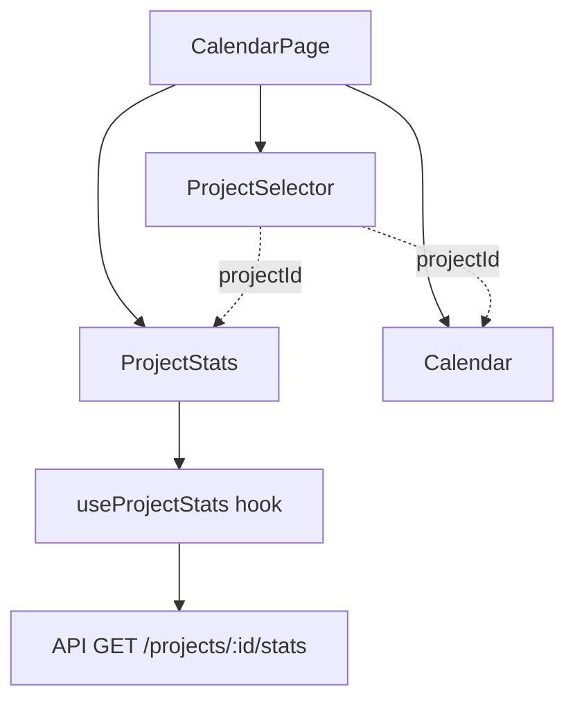

# 📊 Tâche 2.8 : Composant ProjectStats - Résumé de l'implémentation

## 🎯 Objectifs

Créer un composant `ProjectStats` pour afficher les statistiques d'un projet sélectionné sous forme de 4 cartes visuelles.

## ✅ Réalisations

### 1. Création du composant ProjectStats

**Fichier créé :** `frontend/src/components/Project/ProjectStats.tsx` (133 lignes)

**Fonctionnalités :**
- ✅ Affichage de 4 cartes de statistiques
- ✅ Grid responsive : 1 colonne mobile → 2 colonnes tablette → 4 colonnes desktop
- ✅ États gérés : loading (skeleton), error, empty, success
- ✅ Animation hover (scale-105)
- ✅ Icônes Heroicons v2 (24/outline)
- ✅ Code couleur par carte (bleu, vert, violet, orange)

**Statistiques affichées :**

1. **Équipes** 👥
   - Valeur : `stats.nb_equipes`
   - Couleur : Bleu
   - Icône : UserGroupIcon

2. **Gymnases** 🏟️
   - Valeur : `stats.nb_gymnases`
   - Couleur : Vert
   - Icône : BuildingOfficeIcon

3. **Matchs planifiés** 📅
   - Valeur : `stats.nb_matchs_planifies`
   - Sous-valeur : `sur ${stats.nb_matchs_total}`
   - Couleur : Violet
   - Icône : CalendarDaysIcon

4. **Matchs fixés** ✅
   - Valeur : `stats.nb_matchs_fixes`
   - Sous-valeur : `sur ${stats.nb_matchs_planifies}`
   - Couleur : Orange
   - Icône : CheckCircleIcon

### 2. Intégration dans CalendarPage

**Modifications :** `frontend/src/pages/CalendarPage.tsx` (+4 lignes)

```tsx
// Import
import { ProjectSelector, ProjectStats } from '@/components/Project'

// Ajout avant le calendrier
{selectedProjectId && (
  <ProjectStats projectId={selectedProjectId} />
)}
```

**Position :** Entre le `ProjectSelector` et le composant `Calendar`

### 3. Mise à jour des exports

**Fichier modifié :** `frontend/src/components/Project/index.ts` (+1 ligne)

```typescript
export { ProjectSelector } from './ProjectSelector'
export { ProjectStats } from './ProjectStats'
```

## 🛠️ Technologies utilisées

### Nouveaux imports

- **Hooks :**
  - `useProjectStats(id)` depuis `@/hooks`

- **Icônes Heroicons :**
  - `UserGroupIcon` (équipes)
  - `BuildingOfficeIcon` (gymnases)
  - `CalendarDaysIcon` (matchs planifiés)
  - `CheckCircleIcon` (matchs fixés)

### Stack technique

- **React 19.1.1** : Framework UI
- **TypeScript 5.9.3** : Typage strict
- **@tanstack/react-query 5.90.2** : Gestion des données via `useProjectStats`
- **@heroicons/react 2.2.0** : Icônes outline 24px
- **Tailwind CSS 4.1.14** : Styling responsive

## 📈 Architecture du composant

```
ProjectStats
├── Props: { projectId: number | null }
├── Hook: useProjectStats(projectId || 0)
├── États:
│   ├── projectId null → null (pas d'affichage)
│   ├── isLoading → Skeleton (4 cartes grises animées)
│   ├── error → Message d'erreur rouge
│   └── success → Grid avec 4 cartes
└── Grid responsive:
    ├── Mobile (< 640px) : 1 colonne
    ├── Tablette (≥ 640px) : 2 colonnes
    └── Desktop (≥ 1024px) : 4 colonnes
```

## 🎨 Design des cartes

Chaque carte contient :

```
┌──────────────────────────────┐
│  [Titre]          [Icône]     │
│  [Valeur grande]              │
│  [Sous-valeur optionnelle]    │
└──────────────────────────────┘
```

**Couleurs et bordures :**
- Équipes : bg-blue-50, border-blue-200, text-blue-600
- Gymnases : bg-green-50, border-green-200, text-green-600
- Matchs planifiés : bg-purple-50, border-purple-200, text-purple-600
- Matchs fixés : bg-orange-50, border-orange-200, text-orange-600

## ✅ Validation technique

### TypeScript
```bash
npx tsc --noEmit
# ✅ 0 erreurs
```

### Compilation
- ✅ Aucune erreur TypeScript
- ✅ Imports corrects
- ✅ Types respectés (ProjectStats depuis API)

## 📋 Tests recommandés

### Tests fonctionnels

1. **Affichage initial**
   - [ ] Vérifier que les 4 cartes s'affichent avec le projet sélectionné
   - [ ] Vérifier les valeurs affichées correspondent au projet

2. **Changement de projet**
   - [ ] Sélectionner un autre projet dans ProjectSelector
   - [ ] Vérifier que les stats se mettent à jour

3. **États du composant**
   - [ ] Vérifier le skeleton lors du chargement
   - [ ] Simuler une erreur et vérifier le message d'erreur
   - [ ] Désélectionner le projet et vérifier que les stats disparaissent

4. **Responsive**
   - [ ] Mobile (< 640px) : 1 colonne, cartes empilées
   - [ ] Tablette (640-1024px) : 2 colonnes, grid 2×2
   - [ ] Desktop (≥ 1024px) : 4 colonnes, une ligne

5. **Visuel**
   - [ ] Icônes correctement affichées
   - [ ] Couleurs cohérentes par carte
   - [ ] Animation hover fonctionne
   - [ ] Sous-valeurs visibles sur matchs planifiés/fixés

### Tests de non-régression

- [ ] Le sélecteur de projet fonctionne toujours
- [ ] Le calendrier s'affiche toujours en dessous
- [ ] Aucune erreur console
- [ ] Performance acceptable (pas de lag)

## 📊 Métriques de l'implémentation

| Métrique | Valeur |
|----------|--------|
| **Fichiers créés** | 1 |
| **Fichiers modifiés** | 2 |
| **Lignes de code ajoutées** | ~138 |
| **Composants créés** | 1 (ProjectStats) |
| **Icônes utilisées** | 4 |
| **États gérés** | 4 (null, loading, error, success) |
| **Cartes affichées** | 4 |
| **Breakpoints responsive** | 3 (mobile, tablette, desktop) |
| **Erreurs TypeScript** | 0 |
| **Temps d'implémentation** | ~1h |

## 🔄 Workflow d'intégration



## 🚀 Prochaines étapes

### Tâche 2.9 : Header Component
- [ ] Créer `components/Layout/Header.tsx`
- [ ] Logo PyCalendar + FFSU
- [ ] Navigation : Calendrier, Projets, Statistiques
- [ ] Intégrer dans `App.tsx`

### Tâche 2.10 : Error Boundaries
- [ ] Créer `components/ErrorBoundary.tsx`
- [ ] QueryErrorResetBoundary de React Query
- [ ] Fallback UI avec bouton retry

### Tâche 2.11 : Toast Notifications
- [ ] Installer `react-hot-toast`
- [ ] Remplacer `alert()` par `toast()`
- [ ] Custom styling avec Tailwind

## 📝 Notes techniques

### Hook useProjectStats

```typescript
// Signature
function useProjectStats(id: number): UseQueryResult<ProjectStats>

// Type ProjectStats (depuis API)
interface ProjectStats {
  nb_matchs_total: number
  nb_matchs_planifies: number
  nb_matchs_fixes: number
  nb_matchs_a_planifier: number
  nb_equipes: number
  nb_gymnases: number
}
```

### Props du composant

```typescript
interface ProjectStatsProps {
  projectId: number | null
}
```

- `projectId: null` → Composant retourne `null` (pas d'affichage)
- `projectId: number` → Fetch des stats et affichage des cartes

### Gestion des états

1. **projectId null** : `return null`
2. **isLoading** : Skeleton animé avec 4 div grises
3. **error** : Message d'erreur avec fond rouge
4. **!stats** : `return null`
5. **success** : Affichage du grid avec les 4 cartes

## 🎯 Résultat final

### Structure visuelle

```
┌─────────────────────────────────────────────────────────┐
│  Calendrier Sportif                                     │
│                                                          │
│  Projet: [Dropdown ProjectSelector]                    │
│                                                          │
│  ┌──────────┐ ┌──────────┐ ┌──────────┐ ┌──────────┐  │
│  │ Équipes  │ │ Gymnases │ │ Matchs   │ │ Matchs   │  │
│  │   12     │ │    5     │ │ planifiés│ │  fixés   │  │
│  │          │ │          │ │   45/60  │ │  12/45   │  │
│  └──────────┘ └──────────┘ └──────────┘ └──────────┘  │
│                                                          │
│  ┌────────────────────────────────────────────────────┐ │
│  │          CALENDRIER FULLCALENDAR                   │ │
│  │                                                    │ │
│  └────────────────────────────────────────────────────┘ │
└─────────────────────────────────────────────────────────┘
```

### Flux de données

1. Utilisateur sélectionne un projet dans `ProjectSelector`
2. `setSelectedProjectId(id)` met à jour l'état
3. `ProjectStats` reçoit le nouveau `projectId`
4. `useProjectStats(projectId)` fetch les nouvelles stats
5. Les 4 cartes se mettent à jour avec les nouvelles valeurs
6. `Calendar` se met aussi à jour avec le même `projectId`

## 📄 Fichiers modifiés

### Créés
- ✅ `frontend/src/components/Project/ProjectStats.tsx`
- ✅ `frontend/docs/TASK_2.8_SUMMARY.md`

### Modifiés
- ✅ `frontend/src/components/Project/index.ts`
- ✅ `frontend/src/pages/CalendarPage.tsx`

## ✨ Améliorations futures possibles

1. **Graphiques** : Remplacer les cartes par des graphiques (Chart.js, Recharts)
2. **Animations** : Transitions animées lors du changement de valeurs
3. **Tooltips** : Afficher plus d'informations au survol
4. **Export** : Bouton pour exporter les stats en PDF/Excel
5. **Comparaison** : Comparer les stats de plusieurs projets
6. **Historique** : Graphique d'évolution des stats dans le temps
7. **Alertes** : Notifications si certains seuils sont atteints

---

**Implémentation terminée le :** 2025
**Statut :** ✅ COMPLÈTE
**Validation :** TypeScript OK, Compilation OK
