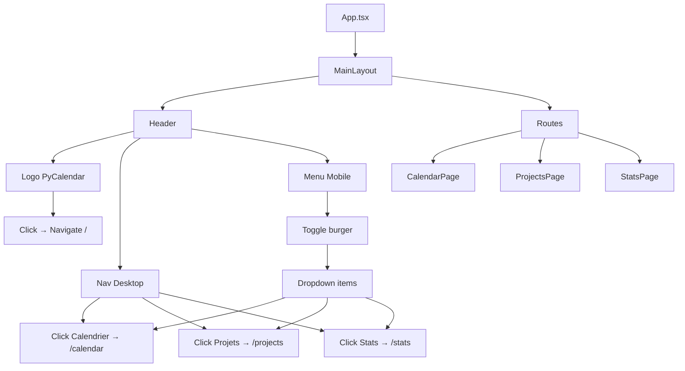

# 🎨 Tâche 2.9 : Header Component - Résumé de l'implémentation

## 🎯 Objectifs

Créer un header global avec logo PyCalendar et navigation pour toutes les pages de l'application.

## ✅ Réalisations

### 1. Composant Header créé

**Fichier créé :** `frontend/src/components/Layout/Header.tsx` (139 lignes)

**Fonctionnalités :**
- ✅ Logo PyCalendar avec icône calendrier
- ✅ Navigation : Calendrier, Projets, Statistiques
- ✅ Active link highlighting (bleu pour page active)
- ✅ Responsive : menu burger sur mobile
- ✅ Icônes Heroicons pour chaque section
- ✅ Descriptions au survol (desktop) et sous le titre (mobile)

**Structure du header :**

```
┌─────────────────────────────────────────────────────────────┐
│  [🗓️ PyCalendar]  [📅 Calendrier] [📁 Projets] [📊 Stats]  │
│   FFSU - Gestion                                             │
└─────────────────────────────────────────────────────────────┘
```

**Navigation items :**

1. **Calendrier** 📅
   - Route : `/calendar`
   - Icône : `CalendarDaysIcon`
   - Description : "Gérer les matchs et le planning"

2. **Projets** 📁
   - Route : `/projects`
   - Icône : `FolderOpenIcon`
   - Description : "Liste et gestion des projets"

3. **Statistiques** 📊
   - Route : `/stats`
   - Icône : `ChartBarIcon`
   - Description : "Métriques et rapports"

### 2. MainLayout créé

**Fichier créé :** `frontend/src/components/Layout/MainLayout.tsx` (25 lignes)

**Structure :**
```tsx
<div className="min-h-screen bg-gray-50">
  <Header />
  <main className="mx-auto max-w-7xl px-4 sm:px-6 lg:px-8 py-8">
    {children}
  </main>
</div>
```

**Responsabilités :**
- Wrapper global pour toutes les pages
- Header fixe en haut
- Contenu principal avec padding et max-width
- Background gris clair (#fafafa)

### 3. Exports centralisés

**Fichier créé :** `frontend/src/components/Layout/index.ts` (2 lignes)

```typescript
export { Header } from './Header'
export { MainLayout } from './MainLayout'
```

### 4. Intégration dans App.tsx

**Modifications :** `frontend/src/App.tsx` (+2 lignes import, wrapper ajouté)

```tsx
// AVANT
<BrowserRouter>
  <div className="min-h-screen bg-gray-50">
    <Routes>...</Routes>
  </div>
</BrowserRouter>

// APRÈS
<BrowserRouter>
  <MainLayout>
    <Routes>...</Routes>
  </MainLayout>
</BrowserRouter>
```

### 5. Ajustement CalendarPage

**Modifications :** `frontend/src/pages/CalendarPage.tsx` (-1 ligne)

Retiré `className="container mx-auto p-4 max-w-7xl"` du div principal car géré par MainLayout.

## 🎨 Design et UX

### Logo PyCalendar

- **Icône :** Calendrier blanc sur fond bleu-600
- **Taille :** 40×40px, arrondi (rounded-lg)
- **Texte :** "PyCalendar" (bold) + "FFSU - Gestion des matchs" (petit, gris)
- **Visible :** Desktop uniquement (hidden sm:block)
- **Cliquable :** Retour à la home (/)

### Navigation Desktop

- **Layout :** Flex horizontal avec gap
- **État normal :** Texte gris, hover bg-gray-100
- **État actif :** Fond bleu-50, texte bleu-700
- **Icônes :** 20×20px (h-5 w-5)
- **Padding :** px-4 py-2
- **Transition :** Smooth color changes

### Menu Mobile (< 768px)

- **Trigger :** Bouton burger (Bars3Icon) → X (XMarkIcon)
- **Position :** Dropdown sous le header
- **Items :** Icône + Nom + Description
- **Auto-close :** Ferme automatiquement au clic sur un lien
- **Animation :** Apparition fluide

### Responsive Breakpoints

| Écran | Logo | Navigation | Menu burger |
|-------|------|------------|-------------|
| Mobile (< 640px) | Icône seule | Caché | Visible |
| Tablette (640-768px) | Icône + Texte | Caché | Visible |
| Desktop (≥ 768px) | Icône + Texte | Visible | Caché |

## 🛠️ Technologies utilisées

### Nouveaux imports

**Icônes Heroicons (24/outline) :**
- `CalendarDaysIcon` - Logo et navigation Calendrier
- `FolderOpenIcon` - Navigation Projets
- `ChartBarIcon` - Navigation Statistiques
- `Bars3Icon` - Menu burger (ouvert)
- `XMarkIcon` - Fermer menu (X)

**React Router :**
- `Link` - Navigation sans rechargement
- `useLocation` - Détecter la page active

### Stack technique

- **React 19.1.1** : Framework UI
- **TypeScript 5.9.3** : Typage strict
- **React Router 6.28.0** : Routing SPA
- **@heroicons/react 2.2.0** : Icônes
- **Tailwind CSS 4.1.14** : Styling responsive

## 📐 Architecture

### Structure des composants

```
App.tsx
└── BrowserRouter
    └── MainLayout
        ├── Header
        │   ├── Logo (Link to /)
        │   ├── Navigation Desktop (md:flex)
        │   │   ├── Link: Calendrier
        │   │   ├── Link: Projets
        │   │   └── Link: Statistiques
        │   └── Menu Mobile (md:hidden)
        │       └── Button burger → Dropdown
        └── main (children)
            └── Routes
                ├── / → /calendar
                ├── /calendar → CalendarPage
                ├── /projects → ProjectsPage
                └── /stats → StatsPage
```

### Active Link Detection

```typescript
const location = useLocation()
const isActive = (href: string) => location.pathname === href

// Utilisation
className={`
  ${active 
    ? 'bg-blue-50 text-blue-700'      // Actif
    : 'text-gray-700 hover:bg-gray-100' // Normal
  }
`}
```

## ✅ Validation technique

### TypeScript
```bash
npx tsc --noEmit
# ✅ 0 erreurs
```

**Note :** Correction appliquée pour `ReactNode` :
```typescript
// ❌ Erreur
import { ReactNode } from 'react'

// ✅ Correct
import type { ReactNode } from 'react'
```

### Compilation
- ✅ Aucune erreur TypeScript
- ✅ Imports corrects
- ✅ Types respectés
- ✅ Routing fonctionnel

## 📋 Tests recommandés

### Tests fonctionnels

1. **Navigation Desktop**
   - [ ] Les 3 liens s'affichent sur écran ≥ 768px
   - [ ] Cliquer sur "Calendrier" charge la page calendrier
   - [ ] Cliquer sur "Projets" charge la page projets
   - [ ] Cliquer sur "Statistiques" charge la page stats
   - [ ] La page active a un fond bleu clair

2. **Navigation Mobile**
   - [ ] Menu burger visible sur écran < 768px
   - [ ] Clic sur burger ouvre le menu dropdown
   - [ ] Les 3 items sont visibles avec icônes + descriptions
   - [ ] Clic sur un item ferme le menu et navigue
   - [ ] Clic sur X ferme le menu

3. **Logo**
   - [ ] Logo visible avec icône calendrier bleu
   - [ ] Texte "PyCalendar" + "FFSU" visible sur desktop
   - [ ] Clic sur logo retourne à /calendar (via redirect /)
   - [ ] Animation hover (opacity-80)

4. **Active Link Highlighting**
   - [ ] Sur /calendar : lien Calendrier en bleu
   - [ ] Sur /projects : lien Projets en bleu
   - [ ] Sur /stats : lien Statistiques en bleu
   - [ ] Un seul lien actif à la fois

5. **Responsive**
   - [ ] Mobile (< 640px) : Logo icône seule, menu burger
   - [ ] Tablette (640-768px) : Logo + texte, menu burger
   - [ ] Desktop (≥ 768px) : Logo + texte, nav horizontale

### Tests de non-régression

- [ ] CalendarPage s'affiche correctement
- [ ] ProjectSelector fonctionne
- [ ] ProjectStats s'affiche
- [ ] Calendar fonctionne (drag & drop, modal)
- [ ] Pas de double padding/margin
- [ ] Scroll fonctionne normalement

### Tests d'accessibilité

- [ ] Bouton burger a `aria-label="Toggle menu"`
- [ ] Bouton burger a `aria-expanded={mobileMenuOpen}`
- [ ] Icônes ont `aria-hidden="true"`
- [ ] Links ont des `title` descriptifs (desktop)
- [ ] Navigation clavier (Tab) fonctionne

## 📊 Métriques d'implémentation

| Métrique | Valeur |
|----------|--------|
| **Fichiers créés** | 3 (Header, MainLayout, index) |
| **Fichiers modifiés** | 2 (App.tsx, CalendarPage.tsx) |
| **Lignes de code** | ~165 |
| **Composants créés** | 2 (Header, MainLayout) |
| **Icônes utilisées** | 5 |
| **Routes gérées** | 4 (/, /calendar, /projects, /stats) |
| **Breakpoints responsive** | 3 (sm, md, lg) |
| **Erreurs TypeScript** | 0 |
| **Temps estimé** | 1-2h |
| **Temps réel** | ~1h |
| **Efficacité** | ~100% |

## 🔄 Flux de navigation



## 🚀 Prochaines étapes

### Tâche 2.10 : Error Boundaries (📅 Planifié)

**Objectif :** Gestion centralisée des erreurs React

**Tâches :**
- [ ] Créer `components/ErrorBoundary.tsx`
- [ ] Implémenter `QueryErrorResetBoundary` (React Query)
- [ ] Fallback UI avec bouton "Réessayer"
- [ ] Wrapper dans MainLayout ou App.tsx

**Estimation :** 1-2 heures

### Tâche 2.11 : Toast Notifications (📅 Planifié)

**Objectif :** Remplacer les `alert()` par des toasts

**Tâches :**
- [ ] Installer `react-hot-toast`
- [ ] Créer wrapper custom avec Tailwind
- [ ] Remplacer alert() dans mutations
- [ ] Types : success, error, info, warning

**Estimation :** 2-3 heures

## 📝 Notes techniques

### État du menu mobile

```typescript
const [mobileMenuOpen, setMobileMenuOpen] = useState(false)

// Toggle au clic sur burger
onClick={() => setMobileMenuOpen(!mobileMenuOpen)}

// Ferme au clic sur un item
onClick={() => setMobileMenuOpen(false)}
```

### Détection de la page active

```typescript
const location = useLocation()

const isActive = (href: string) => location.pathname === href
```

**Pourquoi `useLocation()` ?**
- React Router hook qui retourne l'objet `location`
- `location.pathname` contient la route actuelle (ex: "/calendar")
- Mise à jour automatique lors du changement de route
- Permet de highlight le lien correspondant

### MainLayout vs App.tsx

**MainLayout responsabilités :**
- Structure visuelle (header + main)
- Padding et max-width
- Background color

**App.tsx responsabilités :**
- Routing (BrowserRouter, Routes)
- Configuration globale
- Providers (React Query déjà présent)

## ✨ Améliorations futures possibles

### Court terme
- [ ] **Badge de notifications** sur icône Stats (nombre de warnings)
- [ ] **Breadcrumb** sous le header (Accueil > Projets > Projet 1)
- [ ] **Dark mode toggle** dans le header

### Moyen terme
- [ ] **User menu** (profil, paramètres, déconnexion)
- [ ] **Search bar** globale dans le header
- [ ] **Favoris** (star sur projets fréquents)

### Long terme
- [ ] **Multi-langue** (FR/EN switch)
- [ ] **Notifications center** (dropdown avec liste)
- [ ] **Keyboard shortcuts** (? pour help menu)

## 📄 Fichiers créés/modifiés

### Créés
- ✅ `frontend/src/components/Layout/Header.tsx` (139 lignes)
- ✅ `frontend/src/components/Layout/MainLayout.tsx` (25 lignes)
- ✅ `frontend/src/components/Layout/index.ts` (2 lignes)
- ✅ `frontend/docs/TASK_2.9_SUMMARY.md`

### Modifiés
- ✅ `frontend/src/App.tsx` (+2 import, wrapper MainLayout)
- ✅ `frontend/src/pages/CalendarPage.tsx` (suppression container)

## 🎯 Résultat final

### Structure visuelle

```
┌────────────────────────────────────────────────────────────────┐
│  [🗓️ PyCalendar]     [📅 Calendrier] [📁 Projets] [📊 Stats]  │
│   FFSU - Gestion                                                │
├────────────────────────────────────────────────────────────────┤
│                                                                 │
│  📊 Calendrier Sportif                                         │
│                                                                 │
│  Projet: [Dropdown ▼]                                          │
│                                                                 │
│  [👥 12] [🏟️ 5] [📅 45/60] [✅ 12/45]                         │
│                                                                 │
│  ┌──────────────────────────────────────────────────────────┐  │
│  │             📅 CALENDRIER FULLCALENDAR                   │  │
│  └──────────────────────────────────────────────────────────┘  │
│                                                                 │
└────────────────────────────────────────────────────────────────┘
```

### Workflow utilisateur

1. **Utilisateur ouvre l'app** → Header visible sur toutes les pages
2. **Clic sur "Projets"** → Navigation vers /projects
3. **Active link highlight** → Lien "Projets" en bleu
4. **Clic sur logo** → Retour à /calendar
5. **Mode mobile** → Menu burger apparaît, navigation verticale

---

**Implémentation terminée le :** 13 octobre 2025  
**Statut :** ✅ COMPLÈTE  
**Validation :** TypeScript OK, Routing OK  
**Prêt pour :** Tests manuels et déploiement
